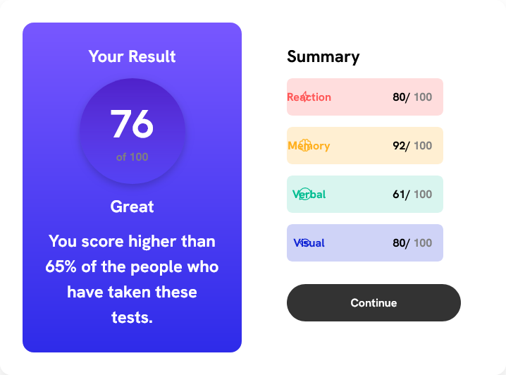

# Frontend Mentor - Results summary component solution

This is a solution to the [Results summary component challenge on Frontend Mentor](https://www.frontendmentor.io/challenges/results-summary-component-CE_K6s0maV). Frontend Mentor challenges help you improve your coding skills by building realistic projects. 

## Table of contents

- [Overview](#overview)
  - [The challenge](#the-challenge)
  - [Screenshot](#screenshot)
  - [Links](#links)
- [My process](#my-process)
  - [Built with](#built-with)
  - [What I learned](#what-i-learned)
  - [Continued development](#continued-development)
  - [Useful resources](#useful-resources)
- [Author](#author)


## Overview

### The challenge

Users should be able to:

- View the optimal layout for the interface depending on their device's screen size
- See hover and focus states for all interactive elements on the page


### Screenshot




### Links


- Live Site URL:(https://result-omega-six.vercel.app/)

## My process

### Built with

- Semantic HTML5 markup
- CSS custom properties
- Flexbox
- Media Quaries
 


### What I learned

I learnt how to use media quaries and how to set my my project to differnt device width


```css 
@media only screen and (max-width:600px){
    .container{
        display: block;
    }

    .result-card{
        width: 100%;
        margin: 0;
    }

    .summary-item{
        width: 100%;
    }

    .label{
        margin-left: -30%;
    }
}
```


### Continued development

I am going to explore more on media queries especially for monile device like tablets, bigger phones, Ipad, etc

### Useful resources

- [ChatGpt](https://chat.openai.com) - This AI model really helped me a lot when I was on the project, it helped me to Write the code in an orderly manner and also helped me to remember certain things I can recall.


## Author

- Frontend Mentor - [@Wizdev0](https://www.frontendmentor.io/profile/Wizdev0)
- Twitter - [@otutech](https://www.twitter.com/otutech)
- Github - [@Wizdev0](https://github.com/Wizdev0)

